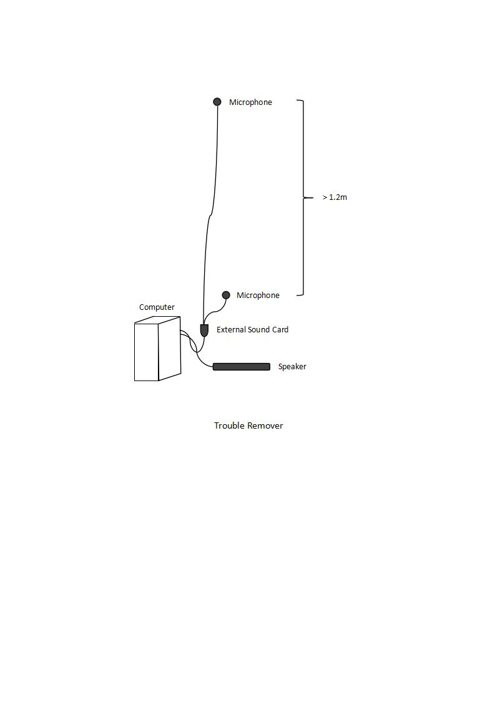

# Trouble Remover

A sound echoer system designed to respond to striking sounds by echoing them back, helping to identify and locate noise sources.



## Overview

Trouble Remover is a Python-based acoustic detection system that listens for specific sound patterns (particularly high-frequency striking sounds) and echoes them back through a speaker. This helps in identifying the source and nature of unwanted noises in your environment.

## Hardware Requirements

To set up the Trouble Remover system, you will need:

- **2 Microphones** - To capture ambient sound
- **1 External Sound Card** - To connect the microphones and create a microphone array
- **1 Speaker** - To echo detected sounds
- **1 Computer** - To run the Python program

### Hardware Setup

1. Connect both microphones to the external sound card
2. Configure the sound card to operate as a microphone array
3. Connect the sound card to your computer
4. Connect the speaker to your computer's audio output

## Software Requirements

- Python 3.x
- Required Python packages (install via pip):
  ```bash
  pip install numpy pyaudio scipy
  ```

## Configuration & Setup

### Step 1: Verify Audio Device Configuration

First, run the device verification script to check your audio setup:

```bash
python py/sounddev.py
```

This script will list all available audio devices. Verify that **device index #1** corresponds to your microphone array. 

### Step 2: Adjust Device Settings (If Needed)

If device index #1 is not your microphone array, you'll need to modify `py/ceilingsnd_phat.py`:

```python
# Change these values to match your system configuration
device_index = 1  # Change to the correct device index
fs = 44100        # Sample rate (adjust if needed)
```

Find the correct device index from the output of `sounddev.py` and update accordingly.

### Step 3: Run the System

Once configured, simply run:

```bash
remove_trouble.bat
```

This will start the Trouble Remover system, which will continuously monitor for striking sounds and echo them back.

## Tuning Sensitivity

If the Trouble Remover is too reactive or not reactive enough, you can adjust the sensitivity parameters in `py/ceilingsnd_phat.py`:

### Parameters

- **`HF_MIN_FREQ_HZ = 400.0`**
  - Minimum frequency threshold (in Hz)
  - Sounds below this frequency are ignored
  - **Increase** this value to ignore more low-frequency sounds (makes the system less sensitive)
  - **Decrease** this value to detect lower frequency sounds (makes the system more sensitive)

- **`HF_ENERGY_RATIO_MIN = 0.05`**
  - Minimum energy ratio threshold
  - Sounds with volume/energy below this threshold are ignored
  - **Increase** this value to ignore quieter sounds (makes the system less sensitive)
  - **Decrease** this value to detect quieter sounds (makes the system more sensitive)

### Balancing Sensitivity

To achieve optimal performance:
- If the system is **too reactive** (echoing too many sounds): Increase one or both values
- If the system is **not reactive enough** (missing sounds): Decrease one or both values
- For **balanced detection**: Try decreasing one parameter while increasing the other

Example adjustments:
```python
# Less sensitive (fewer false positives)
HF_MIN_FREQ_HZ = 600.0
HF_ENERGY_RATIO_MIN = 0.08

# More sensitive (detects more sounds)
HF_MIN_FREQ_HZ = 300.0
HF_ENERGY_RATIO_MIN = 0.03

# Balanced approach
HF_MIN_FREQ_HZ = 350.0
HF_ENERGY_RATIO_MIN = 0.06
```

## Project Structure

```
TROUBLE-REMOVER/
├── images/
│   └── Trouble_Remover.jpg    # Project image
├── py/
│   ├── ceilingsnd_phat.py     # Main sound processing script
│   └── sounddev.py            # Audio device verification script
├── wav/
│   └── 13360.wav              # Sample audio file
├── log.txt                     # Log file
├── remove_trouble.bat          # Windows batch file to run the system
└── README.md                   # This file
```

## Troubleshooting

### No Sound Detection
- Verify microphone array is properly connected and recognized
- Check device index in `ceilingsnd_phat.py` matches your system
- Ensure microphone permissions are granted
- Test microphones with another application

### Too Many False Positives
- Increase `HF_MIN_FREQ_HZ` to filter out more low-frequency noise
- Increase `HF_ENERGY_RATIO_MIN` to ignore quieter ambient sounds

### Missing Target Sounds
- Decrease `HF_MIN_FREQ_HZ` to capture lower frequency strikes
- Decrease `HF_ENERGY_RATIO_MIN` to detect quieter sounds

### Audio Latency Issues
- Ensure your system can handle real-time audio processing
- Close other audio-intensive applications
- Consider adjusting buffer sizes in the code if needed

## Notes

- The system works best in relatively quiet environments
- Position microphones strategically to cover the area of interest
- Experiment with sensitivity settings to find the optimal configuration for your specific environment
- Keep the log file (`log.txt`) for debugging and monitoring system behavior

## License

This project is provided as-is for personal and educational use.
